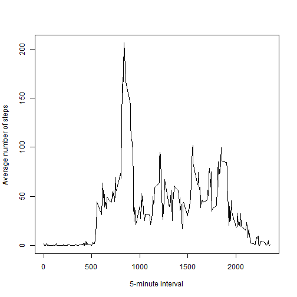
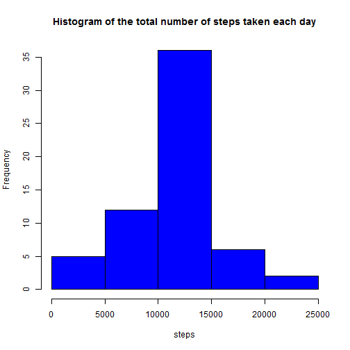

Peer Assessment 1. Reproducible Research
========================================
Loading and preprocessing the data

```r
dataset<-read.csv("c:/Users/Fish/Documents/Temp/activity.csv",sep=",")
dataset$date<-as.Date(dataset$date,"%Y-%m-%d")
Sys.setlocale("LC_TIME", "English")
```
What is mean total number of steps taken per day?

```r
n<-with(dataset,aggregate(steps,by=list(date),sum))
names(n)<-c("date","steps")
n<-n[!is.na(n$steps),]
hist(as.numeric(n$steps),main="Histogram of the total number of steps taken each day",xlab="steps",col="red")
```

 

```r
Men<-mean(as.numeric(n$steps))
print(paste0("The mean total number of steps taken per day: ",Men))
```

```
## [1] "The mean total number of steps taken per day: 10766.1886792453"
```

```r
Med<-median(as.numeric(n$steps))
print(paste0("The median total number of steps taken per day: ",Med))
```

```
## [1] "The median total number of steps taken per day: 10765"
```
What is the average daily activity pattern?

```r
g<-with(dataset,aggregate(steps,by=list(interval),FUN=mean,na.rm = TRUE))
names(g)<-c("interval","steps")
plot(g,xlab="5-minute interval",ylab="Average number of steps ", type="l")
```

 

```r
M<-g$interval[which.max(g$steps)]
print(paste0("This interval contains the maximum number of steps: ",M))
```

```
## [1] "This interval contains the maximum number of steps: 835"
```
Imputing missing values

```r
print("The total number of missing values in the dataset:")
```

```
## [1] "The total number of missing values in the dataset:"
```

```r
nrow(dataset[is.na(dataset$steps),])
```

```
## [1] 2304
```

```r
for(i in 1:nrow(dataset)){
  if(is.na(dataset$steps[i])) {
    x<-subset(g,g$interval==dataset$interval[i])
    dataset$steps[i]<-x$steps
  }
}
n2<-with(dataset,aggregate(steps,by=list(date),sum))
names(n2)<-c("date","steps")
hist(as.numeric(n2$steps),main="Histogram of the total number of steps taken each day",xlab="steps",col="blue")
```

 

```r
Men<-mean(as.numeric(n2$steps))
print(paste0("The mean total number of steps taken per day: ",Men))
```

```
## [1] "The mean total number of steps taken per day: 10766.1886792453"
```

```r
Med<-median(as.numeric(n2$steps))
print(paste0("The median total number of steps taken per day: ",Med))
```

```
## [1] "The median total number of steps taken per day: 10766.1886792453"
```
After filling missing values the mean and median became the same. I fill NA's with the mean for exact 5-minute interval
Are there differences in activity patterns between weekdays and weekends?

```r
dataset$day <- weekdays(dataset$date)                            
for (i in 1:nrow(dataset)) {                                       
    if (dataset$day[i] %in% c("Saturday","Sunday")) {             
        dataset$day[i]<-"weekend"                                 
    }
    else{
        dataset$day[i]<-"weekday"                                 
    }
}
dataset$day <- as.factor(dataset$day) 
n2<-with(dataset,aggregate(steps,by=list(interval,day),mean,na.rm = TRUE))
names(n2)<-c("interval","day","steps")
library(ggplot2)
sp <- ggplot(n2,aes(x=interval, y=steps)) + geom_line()
sp+ facet_grid(day ~ .)
```

 
