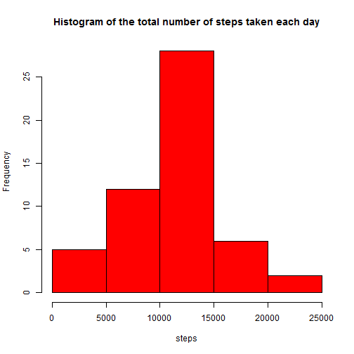
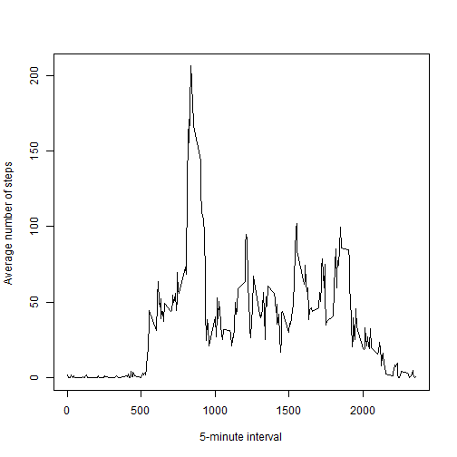
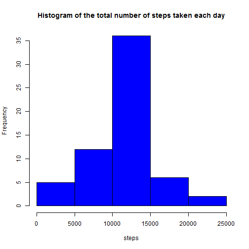

Peer Assessment 1. Reproducible Research
========================================
#Loading and preprocessing the data

```r
Sys.setlocale("LC_TIME", "English")
url<-"http://d396qusza40orc.cloudfront.net/repdata%2Fdata%2Factivity.zip"
download.file(url,"activity.zip")
activity<-unzip("activity.zip")
dataset<-read.csv(activity,sep=",")
dataset$date<-as.Date(dataset$date,"%Y-%m-%d")
dataset$steps<-as.numeric(dataset$steps)
```
##What is mean total number of steps taken per day?

```r
num_of_steps_day<-aggregate(steps~date,dataset,sum)$steps
hist(num_of_steps_day,main="Histogram of the total number of steps taken each day",xlab="steps",col="red")
```

 

The mean total number of steps taken per day:

```r
mean(num_of_steps_day)
```

```
## [1] 10766.19
```
The median total number of steps taken per day:

```r
median(num_of_steps_day)
```

```
## [1] 10765
```
##What is the average daily activity pattern?

```r
num_of_steps_interval<-with(dataset,aggregate(steps,by=list(interval),FUN=mean,na.rm = TRUE))
names(num_of_steps_interval)<-c("interval","steps")
plot(num_of_steps_interval,xlab="5-minute interval",ylab="Average number of steps ", type="l")
```

 

This interval contains the maximum number of steps:

```r
num_of_steps_interval$interval[which.max(num_of_steps_interval$steps)]
```

```
## [1] 835
```
##Imputing missing values
The total number of missing values in the dataset:

```r
nrow(dataset[is.na(dataset$steps),])
```

```
## [1] 2304
```

```r
new_dataset<-dataset
for(i in 1:nrow(new_dataset)){
  if(is.na(new_dataset$steps[i])) {
    x<-subset(num_of_steps_interval,num_of_steps_interval$interval==dataset$interval[i])
    new_dataset$steps[i]<-x$steps
  }
}
new_num_of_steps_day<-aggregate(steps~date,new_dataset,sum)$steps
hist(new_num_of_steps_day,main="Histogram of the total number of steps taken each day",xlab="steps",col="blue")
```

 

The mean total number of steps taken per day:

```r
mean(new_num_of_steps_day)
```

```
## [1] 10766.19
```
The median total number of steps taken per day:

```r
median(new_num_of_steps_day)
```

```
## [1] 10766.19
```
After filling missing values the mean and median became the same. I fill NA's with the mean for exact 5-minute interval

##Are there differences in activity patterns between weekdays and weekends?

```r
dataset$day <- weekdays(dataset$date)                            
for (i in 1:nrow(dataset)) {                                       
    if (dataset$day[i] %in% c("Saturday","Sunday")) {             
        dataset$day[i]<-"weekend"                                 
    }
    else{
        dataset$day[i]<-"weekday"                                 
    }
}
dataset$day <- as.factor(dataset$day) 
avg_week<-with(dataset,aggregate(steps,by=list(interval,day),mean,na.rm = TRUE))
names(avg_week)<-c("interval","day","steps")
library(ggplot2)
sp <- ggplot(avg_week,aes(x=interval, y=steps)) + geom_line()
sp+ facet_grid(day ~ .)
```

 
